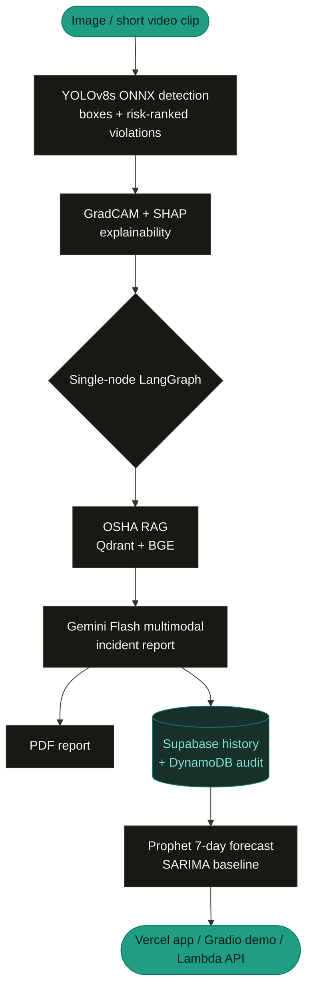

<div align="center">

# 🦺 SafetyVision

### Open-source AI workplace safety monitor — detect PPE violations, explain every decision, forecast compliance. Free, self-hostable, $0 to run.

<!-- Core ML -->


<!-- Explainability, LLM, RAG -->


<!-- Forecasting, experiment tracking -->


<!-- Frontend -->


<!-- Backend, cloud -->


<!-- Project -->


**[🌐 Live app](https://safetyvision.vercel.app)** · **[🤗 Open-source demo](https://huggingface.co/spaces/ayushgupta7777/safetyvision)** · **[🔌 API docs](https://ssbjfzly4mljxkb45moiu2bb6a0nnrrb.lambda-url.ap-south-1.on.aws/docs)** · **[📄 Model card](https://huggingface.co/ayushgupta7777/safetyvision-yolov8)**

</div>

---

Missing hard hats, no high-vis vest, no fall harness at height — the violations human eyes miss when scanning hundreds of frames. SafetyVision is an open-source pre-screening tool that surfaces them for human review, with **explainable** detections, **OSHA-grounded** incident reports, and forward-looking **compliance forecasts**. It replaces commercial tools that charge $500-$2,000/month — and the entire runtime is free-tier, $0.

<div align="center">


[](https://youtu.be/I9FxbBiZ18c)

</div>

---

## Try it — four ways

| | What | Link |
|---|---|---|
| 🌐 **Web app** | The full product — upload, history, dashboard, forecasts, PDF reports, account + API keys | **[safetyvision.vercel.app](https://safetyvision.vercel.app)** |
| 🤗 **Open-source demo** | No signup, image *or* short video — try it instantly in the browser | **[HF Spaces](https://huggingface.co/spaces/ayushgupta7777/safetyvision)** |
| 🔌 **Production API** | Documented REST API with Swagger, Python SDK + CLI on PyPI | **[`/docs`](https://ssbjfzly4mljxkb45moiu2bb6a0nnrrb.lambda-url.ap-south-1.on.aws/docs)** |
| 🛠️ **Deploy your own** | One command — `cd infra/aws && terraform apply` | [GitHub](https://github.com/ayushgupta07xx/SafetyVision) |

---

## What it does

Upload a worksite photo (or short clip on the demo) and SafetyVision:

- **Detects PPE compliance** — finds each worker and checks for hard hats, safety vests, masks, gloves, and fall harnesses, flagging missing-PPE violations in red, ranked by risk level. Fine-tuned **YOLOv8s** exported to **ONNX**, running on **CPU** (no GPU needed).
- **Explains every decision** — a **GradCAM** heatmap shows where the model looked, plus **SHAP** per-pixel attribution. Auditable, not a black box.
- **Writes OSHA-grounded incident reports** — a **multimodal Gemini Flash** model reads the annotated image alongside the actual OSHA regulation (retrieved via **Qdrant + BGE** RAG over 29 CFR 1910 & 1926) and cites the real CFR number.
- **Exports an audit-ready PDF** — one click per violation: annotated image, citation, corrective actions, explainability section.
- **Forecasts 7-day compliance** — a **Prophet** model (benchmarked against a SARIMA baseline) projects the trend per violation type.
- **Remembers your history** — every inspection saved per user (Supabase Postgres + row-level security), surfaced in a history table and a roll-up dashboard.

## Headline metrics

YOLOv8s v2, held-out test set (deployed config: ONNX @ 896):

| Metric | Value |
|---|---|
| **mAP@50** | **0.763** |
| **mAP@50:95** | **0.482** |
| Warm CPU inference (AWS Lambda) | ~500-800 ms / image |

Strongest classes: Fall-Detected (0.956), Hardhat (0.936), Safety Vest (0.891). Weakest: NO-Safety Vest (0.382). The v2 retrain (YOLOv8s + Albumentations on 80k+ images) targeted **0.78** and landed at **0.763** — an honest near-miss, documented in full in the **[model card](https://huggingface.co/ayushgupta7777/safetyvision-yolov8)**.

**Statistical validation (A/B tests):**
- Incident-report quality, RAG vs no-RAG: RAG wins, Cohen's d = 0.65, p = 0.0197 (paired t-test, N=16)
- Confidence threshold 0.40 vs 0.55: 0.40 wins, McNemar p = 4x10^-5 (N=200)

## Architecture



The same core (`core/`, `agent/`, `analytics/`) powers all three surfaces — the only thing that changes per surface is the entry point. Full diagram: [`docs/architecture.md`](docs/architecture.md).

## The three deployment surfaces

- **Mode 3 — Next.js + Vercel (primary):** the product. Next.js 14 + Tailwind + shadcn/ui, Supabase auth (email + Google OAuth), per-user history, forecast dashboard, PDF downloads, API-key management. → [safetyvision.vercel.app](https://safetyvision.vercel.app)
- **Mode 1 — Hugging Face Spaces (open-source demo):** a free Gradio app, no signup, image **or** short video (≤30s). → [HF Spaces](https://huggingface.co/spaces/ayushgupta7777/safetyvision)
- **Mode 2 — AWS Lambda Function URL (production API):** serverless ONNX inference behind a free-forever HTTPS endpoint, API-key auth, Swagger/Redoc docs. **Image-only** (Lambda's 6MB on-wire cap ≈ 4MB raw after base64; video stays on Modes 1 & 3). → [`/docs`](https://ssbjfzly4mljxkb45moiu2bb6a0nnrrb.lambda-url.ap-south-1.on.aws/docs)

## Key design decisions & tradeoffs

Each decision lists the choice, the reason, and what was traded. ADRs in [`docs/decisions.md`](docs/decisions.md).

### Lambda Function URLs over API Gateway (ADR-006)
**Choice.** A Lambda Function URL, not API Gateway. **Why.** Function URLs are free *forever* (API Gateway's free tier expires after 12 months), with a single clean endpoint. API-key auth and rate-limiting are done at the handler level against Supabase. **Trade.** No built-in usage plans / request transformations — not needed for a single `/analyze` endpoint, and API Gateway stays an evaluated, documented alternative.

### YOLOv8s v2 — and an honest 0.763
**Choice.** Upgraded v1 (YOLOv8n, 0.701) to v2 (YOLOv8s + Albumentations on 80k+ images), targeting mAP@50 ≥ 0.78. It landed at **0.763**. **Why ship it anyway.** It's a real improvement with documented per-class gains, and the small variant still fits Lambda's CPU memory budget. **Trade.** A near-miss on the target — stated plainly in the model card rather than buried, because honest metrics are the point.

### Image-only Mode 2 (the 4MB reality)
**Choice.** The production API is image-only; video lives on Modes 1 & 3. **Why.** Lambda Function URLs cap payloads at 6MB on the wire ≈ **4MB raw** after base64 inflation. Responses (annotated + GradCAM + SHAP images) are JPEG q85 and resolution-capped to stay under the same ceiling. **Trade.** No video through the API — a clean documented constraint rather than a flaky 413.

### GradCAM **and** SHAP, not one
**Choice.** Both explainers on every detection. **Why.** GradCAM answers "where did it look" (spatial, intuitive); SHAP answers "which pixels moved the score" (attribution). Together they make a detection trustworthy to a safety officer *and* a reviewer. **Trade.** The SHAP pass is the slowest step — acceptable for a pre-screening tool, surfaced honestly in the latency notes.

### Reused, not rebuilt
**Choice.** Single-node LangGraph (not multi-node), minimal CI, no bespoke observability stack. **Why.** Those patterns already exist in a sibling project; SafetyVision spends its complexity budget on the *new* surface — CV, explainability, forecasting, serverless deploy — not on re-implementing orchestration. **Trade.** Less infra flourish, a tighter and more honest scope.

## API, SDK & CLI

```bash
pip install safetyvision-client
```

```python
from safetyvision_client import SafetyVision

sv = SafetyVision(api_key="sv_...")        # mint a key on the Account page
result = sv.analyze("worksite.jpg")
print(result.violations)
result.save_pdf("incident.pdf")
```

```bash
safetyvision analyze worksite.jpg --pdf report.pdf   # CLI ships with the SDK
```

Full reference: [`docs/api_usage.md`](docs/api_usage.md) · interactive Swagger at the Lambda URL's `/docs`.

## Deploy your own

```bash
git clone https://github.com/ayushgupta07xx/SafetyVision.git
cd SafetyVision

./bootstrap.sh && source .venv/bin/activate     # local dev
cd infra/aws && terraform apply                 # AWS stack (Lambda + S3 + DynamoDB + ECR, ap-south-1)
```

Walkthroughs: [`docs/aws_deploy.md`](docs/aws_deploy.md) · [`docs/supabase_setup.md`](docs/supabase_setup.md). Everything runs on always-free tiers — AWS Lambda/S3/DynamoDB/ECR, Supabase, Vercel, Hugging Face, Qdrant Cloud, Google AI Studio.

## Repository layout

```
safetyvision/
├── model/            # YOLOv8 training artifacts (results, curves, confusion matrix)
├── mlruns/           # MLflow run history (committed)
├── core/             # ONNX detector, GradCAM/SHAP explainer, RAG, Supabase + PDF adapters
├── agent/            # Single-node LangGraph (retrieve -> report -> PDF -> log)
├── analytics/        # Prophet + SARIMA forecasting, synthetic seeders
├── evaluation/       # A/B harness, golden set, committed eval results
├── serving/
│   ├── hf_app/       # Gradio app (Mode 1, HF Spaces)
│   └── lambda/       # FastAPI + Mangum handler, Dockerfile (Mode 2)
├── frontend/         # Next.js 14 + Tailwind + shadcn/ui (Mode 3, Vercel)
├── sdk/              # safetyvision-client — Python SDK + CLI (PyPI)
├── infra/
│   ├── aws/          # Terraform: Lambda + Function URL + S3 + DynamoDB + ECR
│   └── supabase/     # SQL migrations + RLS policies
├── rag_data/         # OSHA corpus scrape + Qdrant ingest
└── docs/             # Model card, ADRs, experiments, deploy + API guides
```

## Tech stack

**Computer vision:** YOLOv8s · OpenCV · ONNX · ONNX Runtime · Albumentations
**Explainability:** GradCAM · SHAP
**LLM / RAG:** Gemini Flash (multimodal) · Qdrant Cloud · BAAI/bge-small-en-v1.5 · bge-reranker-base · LangGraph
**Time series:** Prophet · statsmodels SARIMA
**Evaluation:** Groq llama-3.3-70b (LLM judge) · paired t-test · McNemar · Cohen's d
**Frontend:** Next.js 14 · TypeScript · TailwindCSS · shadcn/ui · Vercel
**Backend / auth:** Supabase (PostgreSQL · Auth · row-level security · OAuth · Storage) · FastAPI + Mangum
**API:** OpenAPI/Swagger · Python SDK + CLI (PyPI)
**ML infra:** MLflow · Weights & Biases
**Cloud:** AWS Lambda · Lambda Function URLs · S3 · DynamoDB · ECR · CloudWatch · Terraform

## Who it's for

Small factory owners and safety managers priced out of enterprise tools · construction-site supervisors · warehouse compliance officers · developers who want to self-host or integrate PPE detection via API/SDK · industrial-CV researchers. Target geography: India + Southeast Asia.

> **Intended use:** an AI-assisted pre-screening tool to support human safety officers. **Not** a replacement for human judgment. See the model card for failure modes and out-of-scope settings.

## License

**AGPL-3.0** for both the repository code and the model weights on Hugging Face Hub (inherited from Ultralytics YOLOv8). Strong copyleft — any derivative, including a network-accessible hosted service, must also be released under AGPL-3.0. See [`LICENSE`](LICENSE).

## Citation

```bibtex
@software{safetyvision_2026,
  author = {Gupta, Ayush},
  title  = {SafetyVision: Open-Source AI Workplace Safety Monitor},
  year   = {2026},
  url    = {https://github.com/ayushgupta07xx/SafetyVision}
}
```

## Acknowledgements

[Ultralytics](https://github.com/ultralytics/ultralytics) (YOLOv8) · [Roboflow Universe](https://universe.roboflow.com) (PPE datasets) · [OSHA](https://www.osha.gov) (public-domain regulations) · [Hugging Face](https://huggingface.co), [Vercel](https://vercel.com), [Supabase](https://supabase.com), [Qdrant](https://qdrant.tech) (free-tier hosting).
