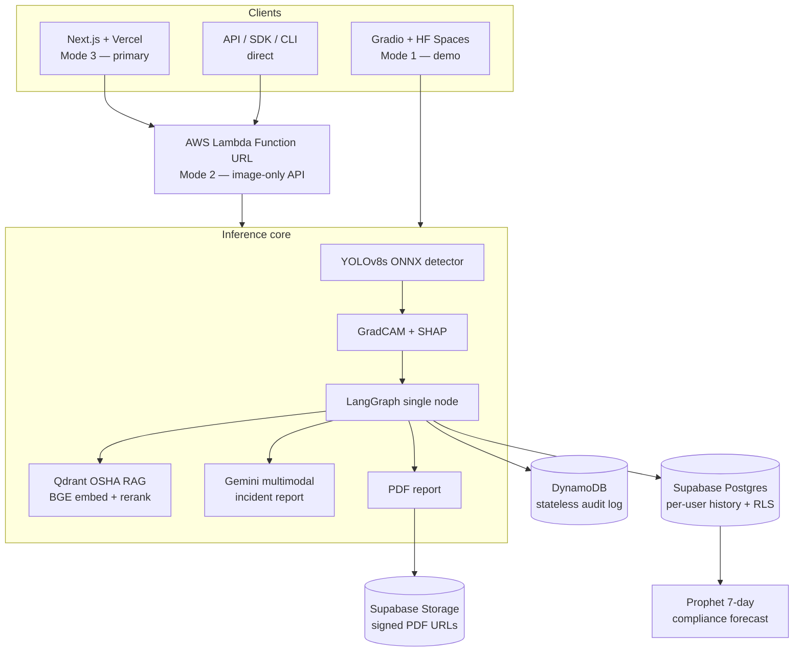

# SafetyVision — Architecture

SafetyVision ships one inference core behind three deployment surfaces. The core
(detection → explainability → RAG-grounded reporting → persistence → forecasting)
is identical across modes; only the entry surface and the persistence target differ.

## Three deployment surfaces

| Mode | Surface | Role | Media | Auth |
|---|---|---|---|---|
| 1 | Gradio on HF Spaces | Open-source demo, embeddable | image + video (≤30s) | none (public) |
| 2 | AWS Lambda Function URL | Production REST API | image-only (6 MB wire ≈ 4 MB raw) | API key (handler-level) |
| 3 | Next.js on Vercel | Primary product UI | image | Supabase session (email + OAuth) |

Mode 2 is image-only because Lambda Function URLs cap payloads at 6 MB on the wire
(~4 MB raw after base64). Video stays on Modes 1 and 3. See `docs/api_usage.md`.

## Data flow

## Inference pipeline (per image)

1. OpenCV preprocess (resize 640, normalize); input capped at 1280px max dim.
2. YOLOv8s ONNX inference → boxes + scores + labels (~300–700 ms CPU).
3. Violation logic (ADR-010): every NO-X surfaces; Person box attaches on IoU≥0.05 else `None`.
4. GradCAM heatmap (SPPF layer) + SHAP GradientExplainer attribution.
5. LangGraph node: retrieve OSHA chunks → Gemini multimodal report → PDF → log.
6. Persist: DynamoDB (Mode 2 audit) + Supabase (Mode 3 per-user history).

Response images are JPEG q85 (not PNG) to stay under the Lambda 6 MB response ceiling.

## Persistence boundary

- **DynamoDB** — stateless, per-invocation audit log for the Lambda API (Mode 2). Not user-scoped.
- **Supabase Postgres** — canonical per-user history (Mode 3), row-level-security isolated.
- **Supabase Storage** — PDF reports, exposed via signed URLs only.

Forecasting (Prophet, SARIMA baseline) reads from sqlite locally / Supabase in Mode 3.
See ADR-008 (forecaster), ADR-015 (PDF persist boundary), ADR-016 (auth model).
